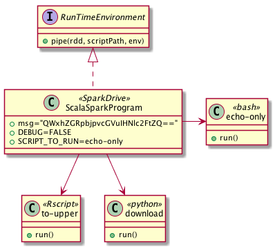

# Usando o método pipe do RDD

## Codificando em Base64

Nos exemplos abaixo cada linha é decodificada de base64 e passada adiante via pipe do BASH para o script 

```scala
// Forçando ocorrencia de erro na váriável de ambiente
// TODO: Falta tratar erro de script não existe dentro da shell decode-base64-and-run-script.sh
val dataRRDD = sc.makeRDD(List("QWxhZGRpbjpvcGVuIHNlc2FtZQ=="))
val piped = dataRRDD.pipe("/spark/DATA/decode-base64-and-run-script.sh", Map("XXX" -> "/spark/DATA/to-upper.sh"))
val result = piped.collect()
result.foreach(println)
```

Executando uma shell bash que faz **apenas um echo** para stdout.
Neste echo a shell coloca como prefixo o nome do HOST do cluster onde ela foi executada.
Lembre-se: Cada tupla do RDD pode rodar em _hosts_ diferentes. 

```scala
val dataRRDD = sc.makeRDD(List("QWxhZGRpbjpvcGVuIHNlc2FtZQ=="))
val env = Map("ENCODING" -> "Base64", SCRIPT_TO_RUN" -> "/spark/DATA/echo-only.sh")
val piped = dataRRDD.pipe("/spark/DATA/decode-base64-and-run-script.sh", env)
val result = piped.collect()
result.foreach(println)
```

Executando uma shell bash que faz apenas uma **conversão para maíusculos** e ecoa para stdout.
Neste echo a shell coloca como prefixo o nome do HOST do cluster onde ela foi executada.

```scala
val dataRRDD = sc.makeRDD(List("QWxhZGRpbjpvcGVuIHNlc2FtZQ=="))
val env = Map("ENCODING" -> "Base64", "SCRIPT_TO_RUN" -> "/spark/DATA/to-upper.sh")
val piped = dataRRDD.pipe("/spark/DATA/decode-base64-and-run-script.sh", env)
val result = piped.collect()
result.foreach(println)
```



Outros esquemas de codificaçãopodem ser vistos a seguir

## Codificando com encodeURI

Este [site](http://meyerweb.com/eric/tools/dencoder/) permite converter de e para URLencode

Em Python temos esse exemplo:

```python
s = u"João Antônio 2017-04-01 12:37.0890 Ação"
print urllib.quote(s.encode("utf-8"))
Jo%C3%A3o%20Ant%C3%B4nio%202017-04-01%2012%3A37.0890%20A%C3%A7%C3%A3o
```

Podemos então invocar dessa forma:

```scala
val dataRRDD = sc.makeRDD(List("Aladdin%3Aopen%20sesame"))
val env = Map("ENCODING" -> "encodeURI", "SCRIPT_TO_RUN" -> "/spark/DATA/to-upper.sh")
val piped = dataRRDD.pipe("/spark/DATA/decodeURI-and-run-script.sh", env)
val result = piped.collect()
result.foreach(println)
```

